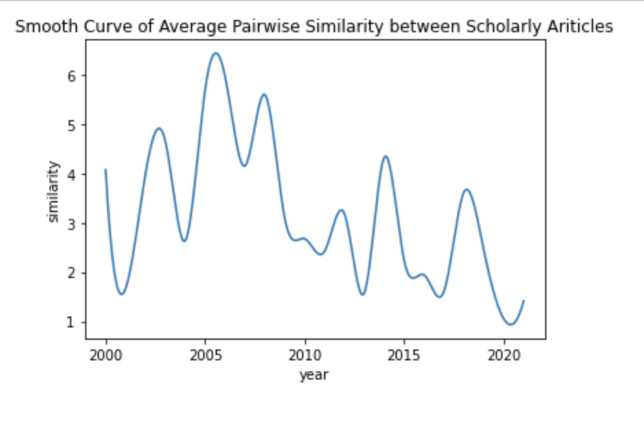
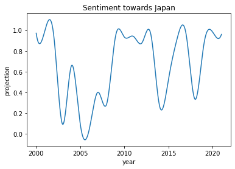

# Chinese Elite Nationalism: Supplemental Code

The code and data in this repository is an example of a reproducible research workflow for the research project "Reading Chinese Elite Nationalism from Foreign Policy Scholarship on China-Japan Relations." 

## Set up Environment
The code is written in Python 3.7.13 and all of its dependencies can be installed by running the following in the terminal (with the `requirements.txt` file included in this repository):

```
pip install -r requirements.txt
```

## Prepare Text Data
Next, you can download the `raw_data` folder and unzip all files wihin the folder by running the following in the terminal:

```
unzip \*.zip
```

Then, you can import the `preprocess` module to reproduce the `text_data.csv` file and descriptive plots about the text data in the Jupyter Notebook `preprocess.ipynb`. 

## Preliminary Analysis

Finally, you can use the `analyze` module to reproduce the preliminary analysis of the data using Doc2Vec and Word2Vec models in the Jupyter Notebook `analyze.ipynb`. In particular, the `plot_d2v_similarities` function generates a graph of average pairwise cosine similarity score for each year's documents, showing the degree of cohesiveness among the stories Chinese scholars tell about China-Japan relations. The graph can be reproduced by running the following code:

```python 
data = analyze.prepare_d2v_documents('text_data.csv', 'stopwords-zh.txt')
D2V = analyze.train_best_d2v_model(data)
similarities_lst = analyze.get_d2v_similarities(D2V, data)
analyze.plot_d2v_similarities(similarities_lst, smooth=True)
```




Furthermore, the `plot_projection` function plots the movement of the word 'Japan' along a sentiment dimension of positive-negative across all years. The graph can be reproduced by running the following code:

```python 
projection = analyze.project_word('日本', 'neg.txt', 'pos.txt')
analyze.plot_projection('Japan', projection)
```



This finding helps answer my research question: 'How does the construction of elite national identity evolve in Chinese scholarly discourse on China-Japan relations  since  2000?' It offers suggestive evidence that, negative sentiment towards Japan seems to correlate with a high degree of cohesiveness in identity construction among elites, whereas positive sentiment seems to correlate with a lack of cohesivness: negativity constrains the space of identity construction, making fewer stories of Self and Other legitimate and speakable. 

This is a pilot study which expects extended future research. If you use this repository for a scientific publication, I would appreciate it if you cited the project as:

```
Duan, Fengyu. "Reading Chinese Elite Nationalism from Foreign Policy Scholarship on China-Japan Relations." (2022), GitHub repository, 
https://github.com/macs30200-s22/replication-materials-isaduan
```
In BibTeX format:

```

@misc{Duan2022,
  author = {Duan, Fengyu.},
  title = {Reading Chinese Elite Nationalism from Foreign Policy Scholarship on China-Japan Relations},
  year = {2022},
  publisher = {GitHub},
  journal = {GitHub repository},
  howpublished = {\url{https://github.com/macs30200-s22/replication-materials-isaduan}}
  }
  
```
