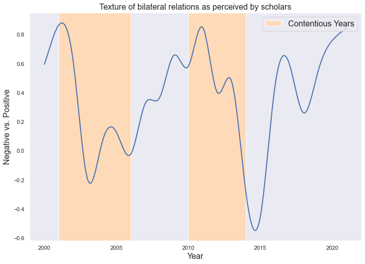
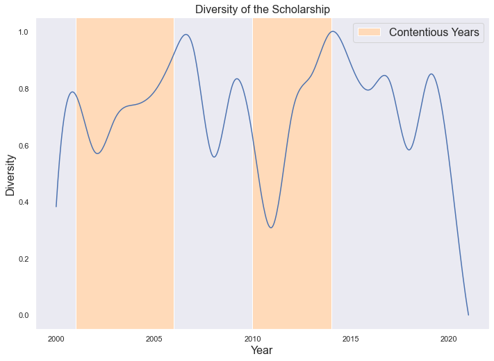
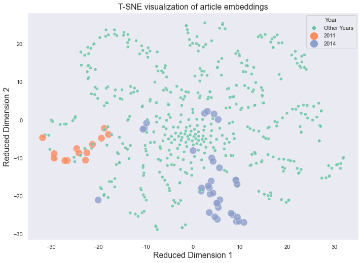
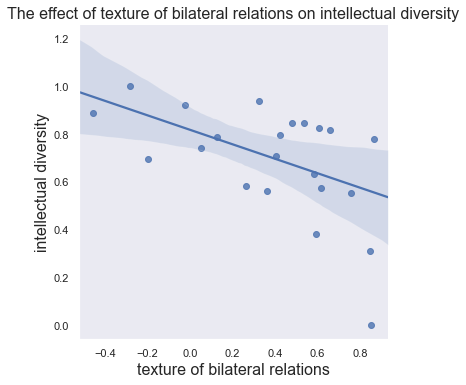

# Creative Clashes: Supplemental Code

The code and data in this repository is an example of a reproducible research workflow for the research project "Creative Clashes: The Fluctuating Space for Intellectual Diversity in China’s Sino-Japan Relations Scholarship." 


## Set up Environment
The code is written in Python 3.7.13 and all of its dependencies can be installed by running the following in the terminal (with the `requirements.txt` file included in this repository):

```
pip install -r requirements.txt
```

## Prepare Text Data
Next, you can download the `raw_data` folder and unzip all files wihin the folder by running the following in the terminal:

```
unzip \*.zip
```

Then, you can import the `preprocess` module to reproduce the `text_data.csv` file and descriptive plots about the text data in the Jupyter Notebook `preprocess.ipynb`. 


## Conduct the Analysis

Finally, you can use the `analyze` module to reproduce the preliminary analysis of the data using Doc2Vec and Word2Vec models in the Jupyter Notebook `analyze.ipynb`. 

In particular, the `plot_projection` function generates a graph of how the texture of China-Japan relations evolves from 2000 to 2021, that is, the movement of the word 'Japan' along a positive-negative sentiment dimension based on Word2Vec models trained on each year’s articles. The graph can be reproduced by running the following code:

```python
projection = analyze.project_word('日本', 'neg.txt', 'pos.txt')
analyze.plot_projection('Japan', "Positive vs. Negative Sentiment", projection)
```


Furthermore, the `plot_d2v_similarities` function generates a graph of how intellectual diversity of the scholarship evolves over time, modelled from one minus average pairwise cosine similarity among each year's documents as estimated by the Doc2Vec model. The graph can be reproduced by running the following code:

```python 
data = analyze.prepare_d2v_documents('text_data.csv', 'stopwords-zh.txt')
D2V = analyze.train_best_d2v_model(data)
similarities_lst = analyze.get_d2v_similarities(D2V, data)
analyze.plot_d2v_similarities(similarities_lst, smooth=True)
```



A T-SNE visualization of articles embeddings estimated by the Doc2Vec model can be reproduced by running the following code: 

```python 
analyze.plot_with_matplotlib(D2V, data, 2011, 2014)
```



Finally, the `run_x_y_regression` function performs a regression analysis examining how intellectual diversity changes in response to change in the texture of the bilateral relations. It offers suggestive evidence that, a more contentious relations between China and Japan correlates with more diversity of the scholarship. The regression analysis and graph can be reproduced by running the following code: 

```python 
analyze.run_x_y_regression(diversity, "intellectual diversity", projection, "texture of bilateral relations", True).summary()
```


This finding helps answer my research question: 'how does the texture of bilateral relations between China and Japan condition the intellectual diversity of Chinese scholarship on the subject from 2000 to 2021?' It supports a 'demand' theory of intellectual diversity, which challenges the longstanding conception of intellectual diversity and suggests an overlooked mechanism for authoritarian resilience. 

This is a pilot study which expects extended future research. If you use this repository for a scientific publication, I would appreciate it if you cited the project as:

```
Duan, Fengyu. "Creative Clashes: The Fluctuating Space for Intellectual Diversity in China’s Sino-Japan Relations Scholarship." (2022), GitHub repository, 
https://github.com/macs30200-s22/replication-materials-isaduan
```
In BibTeX format:

```

@misc{Duan2022,
  author = {Duan, Fengyu.},
  title = {Creative Clashes: The Fluctuating Space for Intellectual Diversity in China’s Sino-Japan Relations Scholarship},
  year = {2022},
  publisher = {GitHub},
  journal = {GitHub repository},
  howpublished = {\url{https://github.com/macs30200-s22/replication-materials-isaduan}}
  }
  
```
